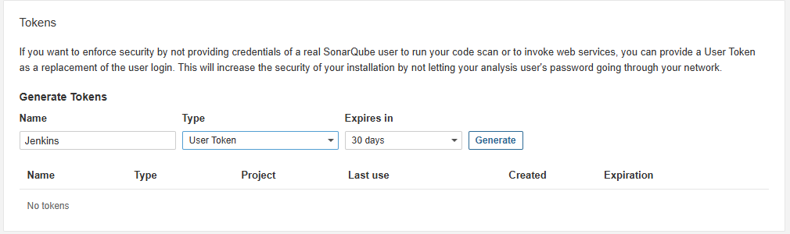
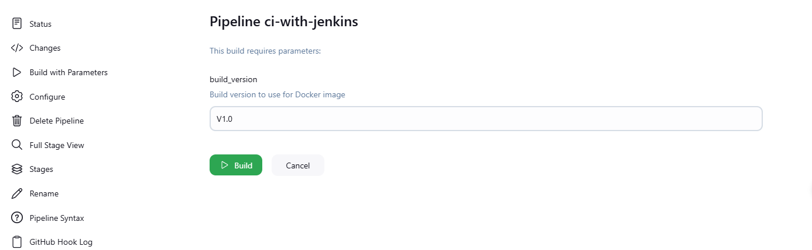

# CI Pipeline With Jenkins, Githubs, Docker, Docker compose and Spring Boot Application

- Repository: [https://github.com/davidvn15/ci-with-jenkins](https://github.com/davidvn15/ci-with-jenkins)

## 1. Run docker-compose.yaml

```shell
cd ci
docker-compose up -d
```

## 2. Access Sonarqube and Get Token

- Login to Sonarqube: [http://localhost:9000/account](http://localhost:9000/account)
- Account: `admin/admin` (change the password after login)
- Get token: [http://localhost:9000/account/security](http://localhost:9000/account/security)



## 3. Access Jenkins and Config Credential

- Login to Jenkins: [http://localhost:8010/](http://localhost:8010/)
- Get Jenkins passcode: 

```shell
docker ps
docker exec -it jenkins bin/bash
cat /var/jenkins_home/secrets/initialAdminPassword
```
- Install Jenkins plugins:
  + Pipeline: Stage View
  + Docker Pipeline
  + Sonarqube Scanner

- Config Jenkins Pipeline:

  + New Item -> Pipeline
  + Build Triggers: GitHub hook trigger for GITScm polling
  + Pipeline -> Definition:
    + Pipeline script from SCM
    + SCM: Git
    + Repositories: [https://github.com/davidvn15/ci-with-jenkins.git](https://github.com/davidvn15/ci-with-jenkins.git)
    + Credentials: None
    + Branches to build: `*/master`
    + Script Path: `ci/Jenkins/Jenkinsfile`
  + Apply and Save.

## 4. Run Pipeline

- Build with parameters:



## 5. Test Application

- The application will be run on port `8090` on your machine.